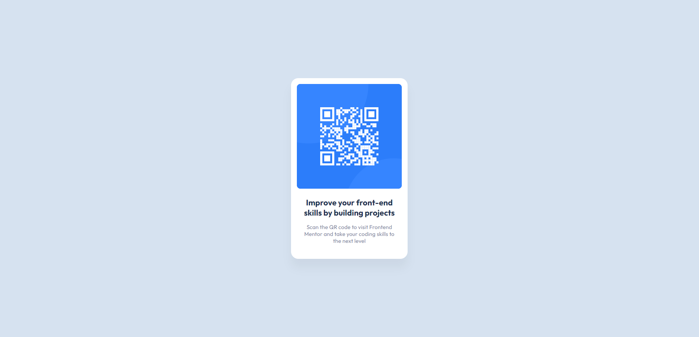

# Frontend Mentor - QR code component solution

This is a solution to the [QR code component challenge on Frontend Mentor](https://www.frontendmentor.io/challenges/qr-code-component-iux_sIO_H). Frontend Mentor challenges help you improve your coding skills by building realistic projects.

## Table of contents

- [Screenshot](#screenshot)
- [Links](#links)
- [Built with](#built-with)

- [Author](#author)

### Screenshot

### Links

- Live Site URL: [QR Code Component](https://shorturl.at/xITV9)

### Built with

- Semantic HTML5 markup
- CSS custom properties
- Flexbox
- Mobile-first workflow
- [Sass](https://sass-lang.com/) - For styles
- [Vite](https://vitejs.dev/) - Build Tool

## Author

Github: [Kulimito](https://github.com/Kulimito)
